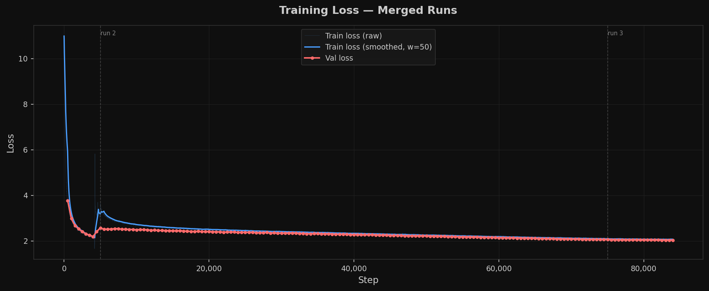

# A LLM trained from scratch

A GPT-style language model trained from scratch on 22B tokens of [Cosmopedia](https://huggingface.co/datasets/HuggingFaceTB/cosmopedia), then instruction-tuned on OpenHermes 2.5. Served via a FastAPI backend with a React chat UI.



---

## What this is

This is a portfolio project documenting the full pipeline of building a small language model — from raw data download, through pretraining and SFT, to a deployed chat interface. The model is not production-grade; it lacks the RLHF polish of commercial models. It does surprisingly well at storytelling and open-ended generation.

The model is called **Senku**. It was trained by Dheeren.

---

## Architecture

Senku is a decoder-only transformer with a LLaMA-style architecture baked into a GPT-2-sized body.

| Component | Choice |
|---|---|
| Normalization | RMSNorm (pre-norm, fp32 upcast) |
| Positional encoding | RoPE (Rotary Position Embeddings) |
| Activation | SwiGLU (d_ff = 8/3 × d_model) |
| Attention | Flash SDPA (causal, `F.scaled_dot_product_attention`) |
| Biases | None (LLaMA-style) |
| Weight tying | No |

Default preset (`gpt2-small`): 768d, 12 layers, 12 heads, ~117M parameters.

### RangeFlow (custom inference constraint)

The inference server implements a novel **RangeFlow** attention constraint. During generation:

1. **Capture pass** — one full forward pass over the prompt records the per-head min/max bounding box of every K and V tensor across all layers.
2. **Guard pass** — during autoregressive generation, each new token's K/V is clamped into the anchor box expanded by ±ε, steering the model to stay semantically close to the prompt.

`range_epsilon` controls tightness: ~0.05 is strict, ~0.20 is loose. This is exposed as a tunable parameter in the chat UI.

---

## Training

### Pretraining

- **Dataset**: [Cosmopedia](https://huggingface.co/datasets/HuggingFaceTB/cosmopedia) — 22B tokens of synthetic, educational web text
- **Tokenizer**: GPT-2 tiktoken (vocab size 50,257 padded to 50,304)
- **Sequence length**: 1024
- **Effective batch size**: 32 × 8 gradient accumulation steps × 1024 = ~262k tokens/step
- **Token Speed during Pretraining**: 400K token/sec
- **Optimizer**: AdamW (β1=0.9, β2=0.95, weight decay=0.1, fused CUDA kernel)
- **LR schedule**: Cosine decay with linear warmup (2,000 steps), peak 6e-4, min 6e-5
- **Precision**: bfloat16 AMP
- **Compile**: `torch.compile(mode="max-autotune")`
- **Total steps**: ~84,000

#### The shuffle bump

Looking at the loss curve, there's a visible bump around step ~6,000. The first run trained with `shuffle=False`. Because Cosmopedia is organized into topical subsets (textbooks, stories, web, etc.), the model saw subset 1 exhaustively before subset 2. It converged on that distribution and loss stalled. Training was stopped, `shuffle=True` was enabled, and training resumed from that checkpoint — the bump is the model unlearning the subset-1 bias and re-generalizing. After the bump, loss resumed its smooth descent to ~2.0.

### SFT (Supervised Fine-Tuning)

- **Dataset**: [OpenHermes 2.5](https://huggingface.co/datasets/teknium/OpenHermes-2.5) — filtered to 50k strict single-turn (user + assistant) conversations
- **Format**: ChatML (`<|system|>`, `<|user|>`, `<|assistant|>`, `<|end|>`)
- **Loss masking**: only assistant tokens are trained on; prompt tokens are masked to -100
- **Filtering**:
  - Drops multi-turn records
  - Drops any assistant turn containing robotic AI-identity boilerplate ("As an AI...", "I was created by OpenAI...", etc.)
  - Replaces explicit model names (ChatGPT, Claude, Gemini, etc.) with "Senku"
  - Injects ~50 explicit identity Q&A pairs ("Who are you?" → "I'm Senku...")
- **Peak LR**: 2e-5 (10× lower than pretraining)
- **Epochs**: 3

---

## Project structure

```
├── metadata/
│   ├── metrics/
│   │   ├── loss_curve.png       # Training loss across all runs
│   ├── model.py                 # GPT architecture (RMSNorm, RoPE, SwiGLU, Flash SDPA)
│   ├── train.py                 # Pretraining loop
│   ├── data.py                  # memmap DataLoader for .bin files
│   ├── scheduler.py             # Cosine LR schedule with warmup
│   ├── checkpoint.py            # Save / load / prune checkpoints
│   ├── logger.py                # Structured logger (CSV metrics + text log)
│   ├── prepare_cosmopedia.py    # Download + tokenize Cosmopedia → train.bin / val.bin
│   ├── sft_data_prepare.py      # OpenHermes → filtered SFT JSON
│   └── sft_trainer.py           # SFT fine-tuning loop
│
├── backend/
│   ├── model.py                 # Inference model (adds RangeFlow to training model)
│   ├── inference.py             # InferenceEngine (blocking + SSE streaming)
│   ├── config.py                # All env-var config (model preset, paths, server, defaults)
│   ├── main.py                  # FastAPI app (health, /generate, /generate/stream, /config)
│   ├── Dockerfile               # CPU-only Docker image (bakes model + tokenizer)
│   └── .env.example             # Local dev environment template
│
├── frontend/                    # React + Tailwind chat UI (Noir Whisper)
│   ├── src/
│   │   ├── components/
│   │   │   ├── ChatArea.tsx     # Message list with Markdown + syntax highlighting
│   │   │   ├── ChatHeader.tsx   # Header with sidebar toggle + new chat
│   │   │   ├── ChatInput.tsx    # Auto-resize textarea with send button
│   │   │   ├── ChatSidebar.tsx  # Collapsible generation parameter panel
│   │   │   ├── ParameterControl.tsx  # Slider / number input for each param
│   │   │   └── TypingIndicator.tsx   # Animated dots while streaming
│   │   ├── hooks/
│   │   │   └── useChatState.ts  # All chat state + SSE streaming logic
│   │   └── lib/
│   │       └── types.ts         # Shared types + API_BASE_URL
│
└── README.md
```

---

## Running locally

### Backend

```bash
# 1. Install dependencies
pip install fastapi uvicorn transformers torch tiktoken python-dotenv

# 2. Copy env template and fill in checkpoint path
cp .env.example .env

# 3. Start the server
python main.py
# → http://localhost:8000
```

The backend exposes:
- `GET  /health` — liveness + model readiness
- `POST /generate` — blocking full response
- `POST /generate/stream` — SSE token-by-token stream
- `GET  /config` — current model config + generation defaults

### Frontend

```bash
cd frontend
npm install
# Set your backend URL
echo "VITE_API_BASE_URL=http://localhost:8000" > .env
npm run dev
# → http://localhost:5173
```

---

## Deployment

### Backend → Google Cloud Run (CPU)

```bash
# Build image (bakes model weights + tokenizer, CPU-only PyTorch)
docker build -t noir-whisper-backend .

# Push and deploy
docker tag noir-whisper-backend gcr.io/<project>/noir-whisper-backend
docker push gcr.io/<project>/noir-whisper-backend

gcloud run deploy noir-whisper-backend \
  --image gcr.io/<project>/noir-whisper-backend \
  --platform managed \
  --region us-central1 \
  --memory 4Gi \
  --cpu 2 \
  --timeout 120 \
  --set-env-vars MODEL_PRESET=gpt2-small,CHECKPOINT_PATH=model/llm_model.pt
```

The image uses CPU-only PyTorch (~200MB vs ~2GB for the CUDA build), bakes the 600MB checkpoint and the GPT-2 tokenizer directly in, and sets `TRANSFORMERS_OFFLINE=1` so there are no network calls at runtime.

### Frontend → Netlify

```bash
cd frontend
npm run build
# Drag dist/ to Netlify, or connect the repo.
# Set env var in Netlify dashboard:
#   VITE_API_BASE_URL = https://<your-cloud-run-url>
```

Add a `netlify.toml` at project root for React Router to work on page refresh:

```toml
[[redirects]]
  from = "/*"
  to   = "/index.html"
  status = 200
```

---

## Generation parameters (exposed in UI)

| Parameter | Default | Effect |
|---|---|---|
| Max tokens | 512 | Hard cap on response length |
| Temperature | 0.7 | Randomness — lower = more focused |
| Top-p | 0.9 | Nucleus sampling threshold |
| Top-k | 50 | Limits candidate tokens per step |
| Repetition penalty | 1.1 | Penalizes already-seen tokens |
| Range epsilon (ε) | 0.1 | RangeFlow tightness — how closely generation stays near the prompt's K/V space |

---

## Known limitations

- The model hallucinates. It was trained on Cosmopedia which is educational/synthetic text — it doesn't know every fact, but it is pretty good for it's size.
- Single-threaded inference (one request at a time). Cloud Run handles load by spinning up more instances.
- No conversation memory — each request is stateless. The frontend sends only the current user message.
- CPU inference on Cloud Run is slow (~5–20 tok/s depending on instance size). Cold starts add a few seconds.