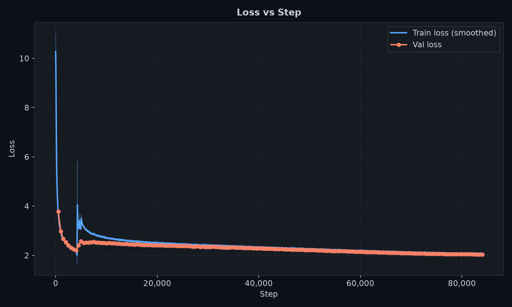

# A LLM trained from scratch

A LLaMA-style language model trained from scratch on 22B tokens of [Cosmopedia](https://huggingface.co/datasets/HuggingFaceTB/cosmopedia), then instruction-tuned on [Smol-Smoltalk](https://huggingface.co/datasets/HuggingFaceTB/smol-smoltalk). Served via a FastAPI backend with a React chat UI.



---

## What this is

This is a portfolio project documenting the full pipeline of building a small language model — from raw data download, through pretraining and SFT, to a deployed chat interface. The model is not production-grade; it lacks the RLHF polish of commercial models. It does surprisingly well at storytelling and open-ended generation.

The model was trained by Dheeren.

---

## Architecture

It is a decoder-only transformer with a LLaMA-style architecture baked into a GPT-2-sized body.

| Component | Choice |
|---|---|
| Normalization | RMSNorm (pre-norm, fp32 upcast) |
| Positional encoding | RoPE (Rotary Position Embeddings) |
| Activation | SwiGLU (d_ff = 8/3 × d_model) |
| Attention | Flash SDPA (causal, `F.scaled_dot_product_attention`) |
| Biases | None (LLaMA-style) |
| Weight tying | No |

Default preset (`gpt2-small`): 768d, 12 layers, 12 heads, ~124M parameters.

### RangeFlow (custom inference constraint)

The inference script implements a novel **RangeFlow** attention constraint. During generation:

1. **Capture pass** — one full forward pass over the prompt records the per-head min/max bounding box of every K and V tensor across all layers.
2. **Guard pass** — during autoregressive generation, each new token's K/V is clamped into the anchor box expanded by ±ε, steering the model to stay semantically close to the prompt.

`range_epsilon` controls tightness: ~0.05 is strict, ~0.20 is loose.

---

## Training

### Pretraining

- **Dataset**: [Cosmopedia](https://huggingface.co/datasets/HuggingFaceTB/cosmopedia) — 22B tokens of synthetic, educational web text
- **Tokenizer**: GPT-2 tiktoken (vocab size 50,257 padded to 50,304)
- **Sequence length**: 1024
- **Effective batch size**: 32 × 8 gradient accumulation steps × 1024 = ~262k tokens/step
- **Token Speed during Pretraining**: 400K token/sec on a H100
- **Optimizer**: AdamW (β1=0.9, β2=0.95, weight decay=0.1, fused CUDA kernel)
- **LR schedule**: Cosine decay with linear warmup (2,000 steps), peak 6e-4, min 6e-5
- **Precision**: bfloat16 AMP
- **Compile**: `torch.compile(mode="max-autotune")`
- **Total steps**: 84,000

#### The shuffle bump

Looking at the loss curve, there's a visible bump around step ~6,000. The first run trained with `shuffle=False`. Because Cosmopedia is organized into topical subsets (textbooks, stories, web, etc.), the model saw subset 1 exhaustively before subset 2. It converged on that distribution and loss stalled. Training was stopped, `shuffle=True` was enabled, and training resumed from that checkpoint — the bump is the model unlearning the subset-1 bias and re-generalizing. After the bump, loss resumed its smooth descent to ~2.0.

### SFT (Supervised Fine-Tuning)

* **Dataset**: HuggingFaceTB/smol-smoltalk (curated mix designed specifically for <1B parameter models). Built-in fallbacks exist for `no_robots`, `alpaca`, or custom `.jsonl` data.


* **Format**: Custom GPT-2 vocabulary extension utilizing special chat tokens (`<|system|>`, `<|user|>`, `<|assistant|>`, `<|end|>`, `<|pad|>`) to properly demarcate turns.


* **Loss Masking**: The model only computes loss on the assistant's content and the explicit `<|end|>` stop token. All role tags, user/system prompt tokens, and right-padded `<|pad|>` tokens are masked to `-100`.


* **Filtering**:
* Dropped examples that exceeded the `max_seq_len` which is 1024, and kept everything else.

* Eliminates duplicate conversations across the dataset using SHA-1 hashing.

* After filtering, the we left with around ~270M tokens to SFT on, we ran it for 2 epochs so total tokens seen was ~550M


* **Batching Strategy**: Avoids naive sequence packing to prevent cross-conversation attention leakage. Places exactly one conversation per sequence and right-pads to the batch's longest example. Utilizes a Length-Grouped Sampler to cluster similar-length examples and drastically reduce padding waste.


* **Peak LR**: `3e-4`, cosine-decaying down to `3e-5`. Employs a fresh AdamW optimizer to discard pretraining momentum states.


* **Epochs**: 2 epochs by default. Incorporates an early stopping patience of 5 evaluation events without validation loss improvement.

---

## Benchmarks

The model was evaluated using EleutherAI's [`lm-evaluation-harness`](https://github.com/EleutherAI/lm-evaluation-harness) across both the base pretraining checkpoint (`best_raw.pt`) and the fine-tuned chat checkpoint (`best_sft.pt`).

### 1. Zero-Shot Core Reasoning (Sub-200M Cohort)

Standardized evaluation on zero-shot scientific and commonsense reasoning benchmarks against established models under 200M parameters. Metrics report length-normalized accuracy (`acc_norm`) for ARC, PIQA, HellaSwag, and OpenBookQA, and raw accuracy (`acc`) for WinoGrande.

| Model | Parameters | Pretraining Tokens | ARC (Norm) | PIQA (Norm) | HellaSwag (Norm) | OBQA (Norm) | WinoGrande | Core Avg |
| :--- | :---: | :---: | :---: | :---: | :---: | :---: | :---: |
| **SmolLM-135M** | 135M | 600B | 43.99% | 69.60% | 42.30% | 33.60% | 52.70% | **48.44%** |
| **MobileLM-125M** | 125M | 1,000B (1T) | 35.51% | 65.30% | 38.90% | 39.50% | 53.10% | |**46.46%** |
| **This Model (Base)** | **124M** | **22B** | **32.18%** | **61.70%** | **31.13%** | **28.60%** | **50.83%** | **40.89%** |
| **GPT2-137M** | ~124M | ~10B–40B | 31.09% | 62.51% | 29.76% | 29.40% | 49.72% | **40.50%** |
| **Pythia-160M** | 160M | 300B | 31.92% | 61.64% | 29.55% | 27.80% | 49.49% | **40.08%** |

*Note: ARC reflects the standard unweighted mean of ARC-Easy (`38.34%`) and ARC-Challenge (`26.02%`).*

#### Key Takeaway
Despite training on only **22B tokens**, the model achieves **3rd place** in its parameter cohort outscoring Pythia-160M (trained on 300B tokens of The Pile) and matching/outperforming GPT-2 across HellaSwag, WinoGrande, and ARC. This validates the sample efficiency of combining SwiGLU activations and RMSNorm pre-normalization with high-density synthetic educational data.

---

### 2. Language Modeling & Compression

Continuous text distribution and long-context tracking evaluated zero-shot via sliding-window cross-entropy:

| Benchmark | Metric | Value | Reference / Notes |
| :--- | :--- | :---: | :--- |
| **WikiText-2** | Bits Per Byte (BPB) | **1.3271** | Near English theoretical entropy boundary (~1.0–1.3) |
| | Byte Perplexity | **2.5089** | Equivalent to $2^{\text{BPB}}$ branching uncertainty |
| | Token Perplexity | **~34.4** | In line with standard GPT-2 Small baseline (~31–36) |
| **LAMBADA (OpenAI)** | Accuracy | **18.18%** | Exact-match target word prediction; matches Pythia-160M |
| | Perplexity | **591.99** | Single target word exponentiated cross-entropy |

---

### 3. SFT Catastrophic Forgetting Audit

To ensure supervised fine-tuning did not erode core pretraining representations ("alignment tax"), the SFT checkpoint was evaluated against the identical raw reasoning tasks[cite: 7, 12]:

| Benchmark Task | Metric | Base (Pretrained) | SFT Checkpoint | Delta | Status |
| :--- | :--- | :---: | :---: | :---: | :---: |
| **HellaSwag** | `acc_norm` | 31.13% | **31.39%** | +0.26\% | Preserved |
| **PIQA** | `acc_norm` | 61.70% | **61.48%** | -0.22\% | Preserved |
| **ARC-Easy** | `acc_norm` | 38.34% | **41.37%** | **+3.03\%** | Improved |
| **ARC-Challenge** | `acc_norm` | 26.02% | **23.72%** | -2.30\% | Slight Drop |
| **OpenBookQA** | `acc_norm` | 28.60% | **29.00%** | +0.40\% | Improved |
| **WinoGrande** | `acc` | 50.83% | **52.57%** | **+1.74\%** | Improved |
| **Core 5-Task Average** | *Mean* | **40.89%** | **41.40%** | **+0.51\%** | **Net Reasoning Gain** |

Targeted prompt-loss masking (`labels = -100`) and low-LR fine-tuning prevented catastrophic forgetting, yielding a net **+0.51%** improvement across core benchmarks.

---

### 4. Instruction Following & Chat Alignment

#### Google IFEval (Verifiable Constraint Following)
Evaluated via `lm_eval` with the official Jinja chat template (`<|system|>`, `<|user|>`, `<|assistant|>`, `<|end|>`). Because the model architecture uses a 1,024-token context window ($T=1024$), generation was capped at `max_gen_toks=512` to preserve prompt headroom:

| IFEval Metric | Score | SmolLM-135M-Instruct (600B) | SmolLM2-135M-Instruct (2T) |
| :--- | :---: | :---: | :---: |
| **Instruction-Level (Loose)** | **37.17%** | ~22.8% | ~37.8% |
| **Instruction-Level (Strict)** | **34.53%** | ~18.5% | ~34.2% |
| **Prompt-Level (Loose)** | **24.95%** | ~14.0% | ~25.5% |
| **Prompt-Level (Strict)** | **22.92%** | ~11.5% | ~22.0% |

*Note: The 512-token generation limit induces an automatic zero-score on test prompts requiring long essays ($\ge 400$ words), making the prompt-level strict metric conservative. Despite this constraint, the model achieves over 37% instruction-level compliance.*

#### Aligned MMLU & OpenBookQA (With Chat Template)
Conditioning questions inside the assistant template (`--apply_chat_template`) improves direct QA grounding over zero-shot base completion:
- **OpenBookQA (`acc_norm`)**: **30.00%** (up from 28.60% base, beating GPT-2's 29.40%)
- **MMLU (Zero-Shot Overall)**: **24.16%** (Social Sciences: **24.18%**, STEM: **23.09%**, Other: **24.88%**)

---

## Project structure

```
├── backend/
│   ├── inference.py             # InferenceEngine (blocking + SSE streaming)
│   ├── config.py                # All env-var config (model preset, paths, server, defaults)
│   ├── auth.py                  # for authetication
│   ├── modal_app.py             # for deployment on modal
│   ├── modal_volume_logger.py   # for storing logs on volume storage
│   ├── rate_limit.py            # for protection from DoS and greedy users
│   ├── main.py                  # FastAPI app (health, /generate, /generate/stream, /config)
│   ├── requirements.txt         # Contains packages required to function
│   └── .env.example             # Local dev environment template
│
├── frontend/                    # React + Tailwind chat UI
│   ├── src/
│   │   ├── components/
│   │   │   ├── ChatMessage.tsx     # Message list with Markdown + syntax highlighting
│   │   │   ├── CodeBlock.tsx   # Header with sidebar toggle + new chat
│   │   │   ├── ChatInput.tsx   # Auto-resize textarea with send button
│   │   │   ├── Sidebar.tsx     # Collapsible generation parameter panel
│   │   ├── hooks/
│   │   │   ├── useChatStream.ts  # All chat state + SSE streaming logic
│   │   │   ├── useBackendStatus.ts # Handles Backend cold start
│   │   │   └── useMediaQuery.ts
│   │   ├── lib/
│   │   │   ├── highlight.ts     # Syntax Highlighter
│   │   │   ├── icons.ts         # Custom Icons for frontpage
│   │   │   ├── markdown.ts      # For markdown rendering
│   │   │   ├── utils.ts
│   │   ├── services/
│   │   │   ├── chatService.ts   # SSE Transport layer
│   │   └── types/
│   │       ├── chat.ts          # Parameter control
│   ├── netlify/
│   │   ├── functions/
│   │   │   ├── chat.ts          # acts as a middleware 
│   │   │   ├── health.ts        # Health ping to wake up backend server
│   ├── App.tsx
│   ├── index.css
|
├── metadata/
│   ├── benchmark/
│   │   ├── base_benchmark_results.json   # Base checkpoint benchmark results
│   │   ├── convert_sft_to_hf.py          # Script used to convert sft ckpt to HF compliant
│   │   ├── convert_to_hf.py              # Script used to convert base ckpt to HF compliant
│   │   ├── sft_forgetting_results.json   # SFT checkpoint benchmark for catastrophic forgetting
│   │   ├── sft_ifeval_results.json       # SFT checkpoint benchmark for Formatting check
│   │   ├── sft_instruct_results.json     # SFT checkpoint benchmark results
│   ├── pretraining_metrics/
│   │   ├── loss.png             # Training loss across all runs
│   │   ├── config.json          # Contains configuration of the run
│   │   ├── dashboard.png        # Has all plots in a single board
│   │   ├── grad_norm.png        # Contains plot of magnitudes of gradients
│   │   ├── throughput.png       # Throughput (tok/sec) throughout run on a H100
│   │   ├── learning_rate.png    # How learning rate decayed throughout the run
│   │   ├── metrics.csv          # Logs of run in a csv format
│   ├── sft_metrics/
│   │   ├── loss.png             # Training loss across all runs
│   │   ├── config.json          # Contains configuration of the run
│   │   ├── dashboard.png        # Has all plots in a single board
│   │   ├── grad_norm.png        # Contains plot of magnitudes of gradients
│   │   ├── throughput.png       # Throughput (tok/sec) throughout run on a H100
│   │   ├── resp_tok_accuracy.png # Response accuracy increase over the whole run
│   │   ├── learning_rate.png    # How learning rate decayed throughout the run
│   │   ├── metrics.csv          # Logs of run in a csv format
│   │   ├── train.log            # Raw logs
│   ├── architecture.py          # GPT architecture (RMSNorm, RoPE, SwiGLU, Flash SDPA)
│   ├── train.py                 # Pretraining loop
│   ├── data.py                  # memmap DataLoader for .bin files
│   ├── scheduler.py             # Cosine LR schedule with warmup
│   ├── checkpoint.py            # Save / load / prune checkpoints
│   ├── logger.py                # Structured logger (CSV metrics + text log) 
│   ├── prepare_cosmopedia.py    # Download + tokenize Cosmopedia → train.bin / val.bin
│   ├── sft_data_prepare.py      # smol-smoltalk dataset in .pt format
│   ├── sft_tokenizer.py         # Helps tokenizing the special tokens
│   ├── sft_train.py             # SFT fine-tuning loop
│   ├── standalone_inference.py  # For Interaction without any servers or deployment
│   └── gguf_standalone_inference.py  # For Interaction with GGUF ckpt without any servers or deployment
│
├──.gitignore
└── README.md
```

---

## Running locally

### Backend

```bash
# 1. Create a UV venv
cd backend
uv venv llm

# 2. Activate UV venv
./llm/Scripts/activate    # on Windows
source llm/bin/activate   # on Linux

# 3. Install PyTorch (Change according to your version)
uv pip install torch torchvision torchaudio --index-url https://download.pytorch.org/whl/cu128

# 4. Instal requirements.txt
uv pip install -r requirements.txt

# 5. Install model weights
hf download dheeren-tejani/smol-lm --local-dir "./models"

# 6. Copy env template and fill in checkpoint path
cp .env.example .env

# 7. Start the server
python main.py
# → http://localhost:8000

# Or if you want to run it as separately
python standalone_inference.py --ckpt ./models/best_sft.pt
```

The backend exposes:
- `GET  /health` — liveness + model readiness
- `POST /generate` — blocking full response
- `POST /generate/stream` — SSE token-by-token stream
- `GET  /config` — current model config + generation defaults

### Frontend

```bash
cd frontend
npm install
# Set your backend URL
echo "VITE_MODAL_BASE_URL=http://localhost:8000" > .env
npm run dev
# → http://localhost:5173
```

---

## Deployment

### Backend → [Modal.com](https://modal.com/)

```bash
# Setup your account on website and login here
modal setup

# Create secrets using modal secrets for env vars (put your value inside the <value>)
modal secret create smol-lm-secrets \
  AUTH_SECRET_KEY=<value> \
  AUTH_KEY_VALUE=<value> \
  RATE_LIMIT_PER_MINUTE=<value> \
  RATE_LIMIT_PER_DAY=<value> \
  MAX_CONCURRENT_GENERATIONS=<value> \
  TRUST_FORWARDED_FOR=<value>

# Create a persistent volume storage for storing request logs
modal volume create smol-lm-logs

# Deploy on modal using modal_app.py
modal deploy modal_app.py

```

The image uses it's own image creation service which will create an image similar to docker image, bakes the ~630MB checkpoint and the GPT-2 tokenizer directly in as the model is small enough for it, then pushes and gives out an endpoint

### Frontend → Netlify

```bash
cd frontend
npm run build
# Drag dist/ to Netlify, or connect the repo.
# Set env var in Netlify dashboard:
# MODAL_BACKEND_URL = https://<your-modal-endpoint>
```

Add a `netlify.toml` at project root for React Router to work on page refresh:

```toml
[[redirects]]
  from = "/api/chat"
  to = "/.netlify/functions/chat"
  status = 200
  force = true

[[redirects]]
  from = "/api/health"
  to = "/.netlify/functions/health"
  status = 200
  force = true

[[redirects]]
  from = "/*"
  to = "/index.html"
  status = 200

[build]
  command = "npm run build"
  publish = "dist"

[functions]
  directory = "netlify/functions"
  node_bundler = "esbuild"

[dev]
  command = "npm run dev:ui"
  targetPort = 5173
```

---

## Generation parameters (exposed in UI)

| Parameter | Default | Effect |
|---|---|---|
| Max tokens | 256 | Hard cap on response length |
| Temperature | 0.2 | Randomness — lower = more focused |
| Top-p | 0.9 | Nucleus sampling threshold |
| Top-k | 50 | Limits candidate tokens per step |
| Repetition penalty | 1.30 | Penalizes already-seen tokens |
| Range epsilon (ε) | 0.2 | RangeFlow tightness — how closely generation stays near the prompt's K/V space |

---

## Known limitations

- The model hallucinates. It was trained on Cosmopedia which is educational/synthetic text — it doesn't know every fact, but it is pretty good for it's size.
- Single-threaded inference (one request at a time).
- No conversation memory — each request is stateless. The frontend sends only the current user message.
- Inference on Cloud Run is around ~200 tok/s due to GGUF. Cold starts add a noticeable seconds.